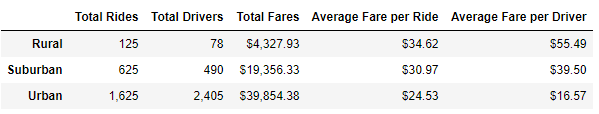
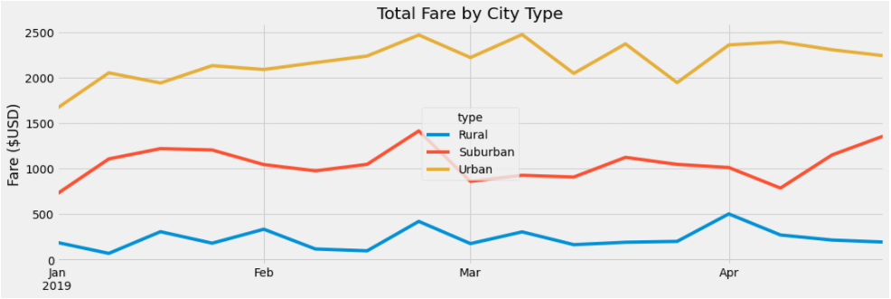

# PyBer_Analysis  
  
## Overview of the analysis:  
  
This purpose of the analysis is to compile a summary of ride sharing data to help management maximize profits for the compnay:  PyBer.  There are two main deliverables:
1. A summary data table, grouped by city type, clearly displaying the total number of rides, total number of active drivers, total fares, average fare per ride, and average fare per driver.  
  
2. A line plot showing the weekly total fares by city type (urban, suburban, and rural) for the period from January 01, 2019 to March 28, 2019.  
  
The analysis clearly shows that the urban ride sharing business brought in more money in total fares than the Suburban and Rural business units combined.  
  
However, on a per ride basis and a per driver basis the Rural and Suburban business units are more profitable.  This highlights the possibility that company profit could be optimized by adjusting the distribution of resources- drivers- differently.  
  
## Data Summary:  

The data for this analysis are in two .csv files.  
[Cities and number of drivers](Resources/city_data.csv)  
[Ride data](Resources/ride_data.csv)  
The city file contains 120 cities with theis total number of active drivers and type clasification as either urban, suburban, or rural.  

The rides file contains 2,375 rides with date and time, the fare, and a unique ride ID.  

The files were read and merged into a single data frame.  
  
## Results:  
  
The data table extracted from the raw data is below.  
  
The summary data show that the majority (68%) of the rides were in urban cities and that, on average, the fares collected in urban cities were lower than in either suburban or rural cities.  One can infer from the data that the average ride distances are shorter for urban areas.  This result is expected; urban areas are, by definition, more densely populated than suburban and rural areas and ride destinations (restaurants, clubs, movie theaters) tend to be closer to areas with housing.  
  
The relationship between total drivers and total rides raises questions about the PyBer business.  In particular, there are more drivers than total rides.  The relationship is particularly stark in urban cities.  The abundance of available drivers results in an average fare of only $16.57 per driver.  
  
PyBer should track the number of fares collected per driver to understand the number of active drivers rather than just the number of people registered to be drivers.  That data would allow the company to optimize the number of drivers for an area to maximize corporate and driver profits.  
  
The plot of total fare by city type for the first 4 months of 2019 is saved in the Analysis folder:  
[Total fare by city type](Analysis/Total_fare_by_City_Type.png)  
  
The plot is shown below.  
  

The plot shows that the relationships between the number of rides in the city types is fairly consistent.  However, within each city there is variability with time.  The variability could be used to target fare changes or incentive programs.  As an example, Perhaps a slight decrease in the fare in January or a small incentive program could increase usage in urban and suburban cities.  

## Summary:  
  
The data compiled from the city type and ride data show that PyBer has room to optimize the business.  Please consider these recommendations based on observations from the compiled data:  
  
1. The urban cities have too many drivers.  PyBer should focus advertising in suburban areas and encourage some of the urban drivers to service suburban cities. Having more drivers in Suburban areas will decrease the response time for riders to be picked up- a fact that could be highlighted in the suburban ad campaign.  
  
2. Target pricing to help even out the ridership over time.  For urban cities decrease the fares slightly in January and raise the fares slightly in February and March.  
  
3. There are spikes in weekly ridership at various times in all city types.  Extract (or collect) data on rider destination and, if possible, the reason for the trip to try to understand the increases.  That data will help to predict, plan, and advertise for increase ridership.  
